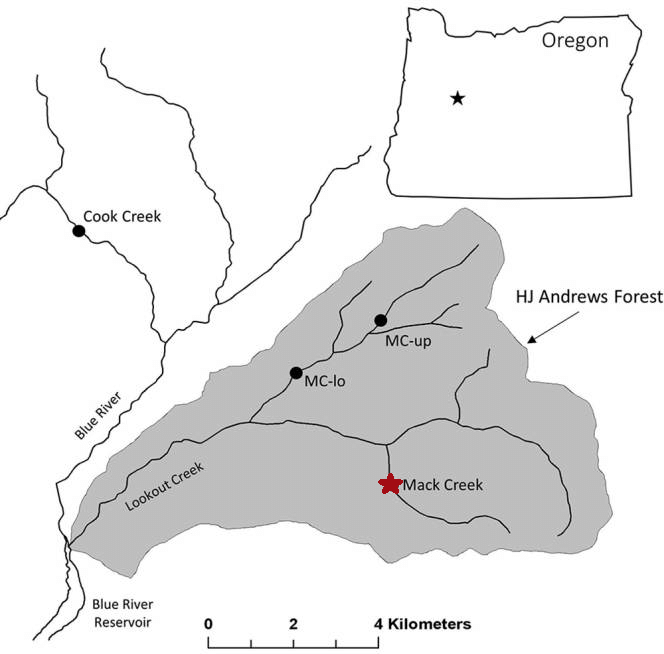

```{r setup, include=FALSE}
knitr::opts_chunk$set(echo = FALSE,
                      message = FALSE,
                      warning = FALSE,
                      results = 'hide')
```

```{r}
# Attach packages

library(tidyverse)
library(janitor)
library(here)
library(kableExtra)
library(ggbeeswarm)
library(car)
library(ggridges)
library(data.table)
library(effsize)

# Read in Mack Creek Vertebrates.csv

mack_creek_df <- read_csv(here::here("raw data", "mack_creek_vertebrates.csv")) %>% 
  clean_names() %>%  # Change column names to lower case
  rename("channeltype" = "unittype") # Rename "unittype" column to "channeltype" for more clarity
```

## Introduction

The Pacific giant salamander, *Dicamptodon tenebrosus*, is native to the Pacific Northwest, and at 13 inches in length, it is one of the largest salamanders in North America (OregonWild). Researchers rely on the salamanders to indicate water quality levels, for these amphibians only live in healthy mountain streams. However, habitat loss through logging and other human activities has raised concerns for the continuation of the species (OregonWild). 

Populations of Pacific giant salamanders have been monitored since 1987 (Gregory). A group Oregon State researchers stationed at the HJ Andrews Experimental Forest were already researching the West Slope cutthroat trout, *Onchorhyncus clarki clarki*, at Mack Creek when they decided to include the salamanders in their studies. Each specimen was measured and weighed before release. The number and weight of salamanders were compared between the different areas where they were found, the forest sections (clear cut(CC) and old growth(OG)) and the channel types (cascade, pool, and side channel). 


***Figure 1.*** *Pacific giant salamander. Credit: [Jeffrey Marsten](https://en.wikipedia.org/wiki/Pacific_giant_salamander#/media/File:Dicamptodon_tenebrosus_2.JPG)*

## Data and Methods

The data for Pacific giant salamander abundance and weights was collected from 1987-2017 in two standard reaches of Mack Creek in the HJ Andrews Experimental Forest, OR. The specimens in sub-reaches were collected via 2-pass electrofishing before being measured, weighed, and released. The two reaches were characterized by different forest sections: old growth (OG) and new growth (CC). OG refers to the 500 year old coniferous forest upstream and CC refers to the clear-cut section of the forest. The locations where the salamanders were found were further divided into the different channel types: cascade, pool, and side channel. 


***Figure 2.*** *Map of Mack Creek within the HJ Andrews Experimental Forest. Identified with a red star. Credit: [Dana Warren-Oregon State](https://www.researchgate.net/figure/Map-of-study-sites-and-the-HJ-Andrews-Experimental-forest-HJA-Each-dot-represents-a_fig1_314206020)*

## Results

```{r}
# Data frame to pull for all results. 
mack_creek_data <- mack_creek_df %>% 
  select(entity, section, channeltype, weight, year)

# Note: Weights is in grams (from metadata)
```

### A. Annual Salamander Counts in Old Growth (OG) and Clear Cut (CC) Sections of Mack Creek


```{r}
# Counting for section (clear and old growth)

mack_creek_cc_og <- mack_creek_data %>% 
  group_by(section, year) %>% 
  summarize(counts = sum(entity)) 

```

The number of giant salamanders did not change much between the two forest sections. Though more salamanders were found in clearcut (n = `r mack_creek_cc_og$counts[1]`) than old growth (n = `r mack_creek_cc_og$counts[32]`) sections in 1987, both soon followed similar trends of abundance. Salamander counts increased toward 2017, though they seemed to reach their peak for both sections from 2008 to 2012. Then both dipped until 2015, when populations numbers started rising again into 2017 (CC = `r mack_creek_cc_og$counts[31]`, OG = `r mack_creek_cc_og$counts[62]`).  

```{r}
# Graph for changes in yearly salamander population in these two sections over time 

ggplot(data = mack_creek_cc_og, aes(x = year, y = counts)) +
  geom_line(aes(color = section), size = 1) +
  scale_x_continuous(lim = c(1987, 2017),
                     expand= c(0,0),
                     breaks = seq(0, 2017, 5)) +
  labs(x = "Year", 
       y = "Salamander Counts",
       title = "Yearly giant salmander count from Mack Creek, 1987-2017") + 
  scale_color_manual(name = "Forest Sections",
                     labels = c("Clear Cut",
                                 "Old Growth"),
                     values = c("CC" = "darkolivegreen1",
                                "OG" = "darkgreen")) +
  theme_bw()


ggsave(here::here("figures", "Yearly Salamander Population.png"))

```
***Figure 3.*** *Change in yearly giant salamander abundance between different forest sections(light green: clear cut, dark green: old growth). Both counts increased through the years without much visual difference.*

### B. Salamander Counts by Channel Classification


```{r}
# Clean data subset so that it only includes 2017 observations
mack_creek_weight_2017 <- mack_creek_data %>% 
  filter(year == 2017)


# Determining the counts of salamanders in different channel types in different forest sections for 2017

mack_creek_class_count <- mack_creek_weight_2017 %>% 
  filter(channeltype %in% c("C", "P", "SC")) %>% 
  count(channeltype, section)

# Changing the labels for the channel types. Can't seem to change the row names in the actual table below and can't use pipe operator to combine these steps. 

mack_creek_class_count$channeltype <- gsub("C", "Cascade", mack_creek_class_count$channeltype) 

mack_creek_class_count$channeltype <- gsub("P", "Pool", mack_creek_class_count$channeltype)

mack_creek_class_count$channeltype <- gsub("SChannel", "Side Channel", mack_creek_class_count$channeltype)

# Creating a data table from the counts

mack_creek_class_table <- mack_creek_class_count %>% 
  pivot_wider(names_from = section, values_from = n)

```

Just looking populations in the final data collection year, 2017, the proportions of giant salamanders were almost 50% when comparing salamander counts for all channel types across clearcut and original growth sections. This suggests salamanders had almost no preferences between the forest sections, which mirrors the visual results found in Results A. However, there is a large difference in salamander counts between the different channel types. There were more giant salamanders in cascades (CC = `r mack_creek_class_count$n[1]`, OG = `r mack_creek_class_count$n[2]`) than from the numbers in pools (CC = `r mack_creek_class_count$n[3]`, OG = `r mack_creek_class_count$n[4]`) and side channels (CC = `r mack_creek_class_count$n[5]`, OG = `r mack_creek_class_count$n[6]`) combined. 


***Table 1.*** *The number of giant salamanders found across different parts of the forest. The proportions were calculated and found at almost 50% between CC and OG sections. However, numbers found in cascades greatly exceeded those found in pools or side channels.* 
```{r}
# Now finding the proportions

mc_props <- mack_creek_class_table %>% 
  janitor::adorn_percentages(denominator = "row") %>% 
  adorn_pct_formatting(digits = 0) %>% 
  adorn_ns(position = "front")

# Setting up in a kable table 

mc_props <- mc_props %>% 
  rename("Channel type" = channeltype,
         "Clear cut" = CC,
         "Original growth" = OG)

mc_table <- kable(mc_props) %>% 
  kable_styling(bootstrap_options = "striped",
                  full_width = F,
                position = "left") %>% 
  add_header_above(c("Proportion of giant salamaders in different channel types and forest sections" = 3))


mc_table


```
`r mc_table`


### C. Hypothesis Testing: Significant Difference in Location?

```{r}
# Testing the association by chi squared tests

chi_counts <- mack_creek_class_table %>% 
  select(-channeltype)

chi_counts

mack_creek_chi <- chisq.test(chi_counts)

mack_creek_chi
```

Based on the substantial differences in salamander numbers between channel types in clear cut and original growth forest sections, the relationship between them was tested to determine association. There is a significant effect of forest condition (CC/OG) on where in the channel salamanders are found (cascade/pool/side-channel) ($\chi$^2^(`r mack_creek_chi$parameter`) = `r round(mack_creek_chi$statistic,2)`, *p* = `r round(mack_creek_chi$p.value, 2)`). The proportions in Table 1 suggest that channel type has stronger effects on salamander locations in forest sections than the other way around. 

### D. Comparison of Salamander Weights in OG and CC Sections

First, we checked the distribution of the salamander weight data in the two forest sections. After our analysis, we discovered that the data for both sections are positively skewed. The QQ plots do not show a linear relationship, meaning that the distribution is not normal. 

```{r}
# Further filter subset so that it only considers creek section for now
mack_creek_weight_section <- mack_creek_weight_2017 %>% 
  select(-channeltype) # Remove channel column

# Find mean weight for the two sections
mc_weight_section_summary <- mack_creek_weight_section %>% 
  group_by(section) %>%  # Group by section
  summarize(
    mean_weight = mean(weight, na.rm = TRUE), # Find mean, remove NA values
    sd_weight = sd(weight, na.rm = TRUE), # Find standard deviation, remove NA values
    sample_size = n(), # We don't use count() because data is already grouped by section
    se_weight = sd_weight / sqrt(sample_size), # Find standard error
    var_weight = var(weight, na.rm = TRUE) # Find variance
  ) 
```

The sample sizes for both sections ($n_{CC}$ = `r mc_weight_section_summary$sample_size[1]` and $n_{OG}$ = `r mc_weight_section_summary$sample_size[2]`) are large enough for us to assume that the distribution of mean weight is normal due to the Central Limit Theorem.

```{r}
# Levene's Test (hypothesis test for equal variances):
# H0: group variances are equal

leveneTest(weight ~ section, data = mack_creek_weight_section)

# Null hypothesis is rejected but largest variance is greater than 4x the smallest variance
```


```{r}
# First, create vector for naming forest section
section_name <- c("Clear Cut", "Old Growth")
names(section_name) <- c("CC", "OG")

# Next, store mean weights for both sections as vectors

mean_weight_cc <- mack_creek_weight_section %>% 
  filter(section == "CC") %>% # Keep only rows that are in CC
  pull(weight) # Pull weight column as vector

mean_weight_og <- mack_creek_weight_section %>% 
  filter(section == "OG") %>% # Keep only rows that are in CC
  pull(weight) # Pull weight column as vector

# Histograms

ggplot(data = mack_creek_weight_section,
       aes(x = weight)) +
  geom_histogram(color = "darkgreen",
                fill = "darkgreen") + 
  labs(x = "Salamander Weight (g)",
       y = "Number of Salamanders",
       title = "Distribution of Giant Salamander Weights in Mack Creek by Forest Section, 2017") + # Add labels and title
  geom_point(data = mc_weight_section_summary, aes(x = mean_weight, y = 200), col="red", size = 2) + # Show mean for each channel type as a red point
  theme_minimal() +
  theme(
    strip.background = element_rect(color="black", size=1, linetype="solid"), # Change format of facet labels
    strip.text = element_text(face = "bold") # Bold facet labels
    ) +
  facet_wrap(~section, # Facet histogram by section
             labeller = labeller(section = section_name)) # Rename facet labels to section name

# Save graph
ggsave(here("figures", "Average Salamander Weight by Section.png"))

```
***Figure 6.*** *Distribution of salamader weights in clear cut and old growth forest sections. The red dots represent the mean weight. Visually, the variance of salamanders weights *

After doing our exploratory analysis, we decide to do a **unpaired, 2 sample two-sided T-test** to explore mean salamander weights between the two sections. We assume that the data is unpaired because the two sections are directly connected to each other. 

#### Unpaired T-test

**Null Hypothesis:** The mean salamander weights in both sections are the same.

**Alternative Hypothesis:** The mean salamander weights in both sections are nOT the same.

```{r}
# Perform unpaired, 2-sample T-test
weight_section_ttest <- t.test(mean_weight_cc, mean_weight_og, paired = FALSE)

weight_section_ttest
```

In 2017, the mean salamander weight (g) for the clear-cut section (`r round(mc_weight_section_summary$mean_weight[1])`$\pm$ `r round(mc_weight_section_summary$sd_weight[1], 2)`, $n_{CC}$ = `r mc_weight_section_summary$sample_size[1]`) and the old growth section (`r round(mc_weight_section_summary$mean_weight[2])`$\pm$ `r round(mc_weight_section_summary$sd_weight[2], 2)`, $n_{OG}$ = `r mc_weight_section_summary$sample_size[2]`) differed significantly by a unpaired two-sample t-test (t(`r round(weight_section_ttest$parameter, 2)` = `r round(weight_section_ttest$statistic, 2)`, *p* = `r ifelse(round(weight_section_ttest$p.value, 3) == 0, "<.001", round(weight_section_ttest$p.value, 3))`).

However, because we previously assumed that the variances for the two groups are not equal, the assumption of normality is invalid. A non-parametric test would be more appropriate to analyze the salamander weights from the two sections.

### E. Comparison of Salamander Weights in Pools, Cascades, and Side Channels

We also checked the distribution of the salamander weight data across the three channel classifications. After our analysis, we discovered that the data for all three channel types are positively skewed. The QQ plots do not show a linear relationship, meaning that the distribution is not normal. 

```{r}
# Create another subset for considering channel type only
mack_creek_weight_channel <- mack_creek_weight_2017 %>% 
  select(-section) %>% # Remove section column
  filter(channeltype %in% c("C", "P", "SC")) # Remove rows that contain IP

# Find mean weight for the two sections
mc_weight_channel_summary <- mack_creek_weight_channel %>% 
  group_by(channeltype) %>%  # Group by section
  summarize(
    mean_weight = mean(weight, na.rm = TRUE), # Find mean, remove NA values
    sd_weight = sd(weight, na.rm = TRUE), # Find standard deviation, remove NA values
    sample_size = n(), # We don't use count() because data is already grouped by section
    se_weight = sd_weight / sqrt(sample_size), # Find standard error
    var_weight = var(weight, na.rm = TRUE) # Find variance
  ) 
```

```{r}
# Levene's Test
# H0: group variances are equal

leveneTest(weight ~ channeltype, data = mack_creek_weight_channel)

# Null hypothesis is rejected but largest variance is greater than 4x the smallest variance, so we can use ANOVA
```

The sample sizes for the three channel types ($n_C$ = `r mc_weight_channel_summary$sample_size[1]`, $n_P$ = `r mc_weight_channel_summary$sample_size[2]`, and $n_{SC}$ = `r mc_weight_channel_summary$sample_size[3]`) are large enough for us to assume that the distribution of mean weight is normal due to the Central Limit Theorem. 

```{r}
# Create vector for naming channel types

channel_name <- c("Cascade", "Pool", "Side Channel")
names(channel_name) <- c("C", "P", "SC")

# Create violinplot

ggplot() + # Leave ggplot blank to graph from multiple data frames
  geom_violin(data = mack_creek_weight_channel, # Start violin plot
              aes(x = channeltype,
                  y = weight),
              color = "darkgreen",
              fill = "darkgreen",
              alpha = 0.3) +
  labs(x = "Channel Classification",
       y = "Salamander Weight (g)",
       title = "Distribution of Giant Salamander Weights in Mack Creek by Channel Type, 2017") +
  geom_point(data = mc_weight_channel_summary, 
             aes(x = channeltype, 
                 y = mean_weight), 
             col="red") + # Show mean for each channel type as a red point
  geom_errorbar(data = mc_weight_channel_summary,
                aes(x = channeltype, 
                    ymin = mean_weight - sd_weight,
                    ymax = mean_weight + sd_weight),
                color = "red",
                width = 0.1) + # Draw error bars
  scale_x_discrete(labels = channel_name) + # Rename x-axis labels
  theme_minimal()
```
***Figure 8.*** *Distribution of salamader weights in cascades, pools, and side channels. The red dots and lines represent the mean weight and the error bars. Visually, the variance of salamanders weights *

After doing our exploratory data analysis, we decide to do an **one-way ANOVA ** test to explore salamander weights between the three channel classifications. There are three samples to test, so we need to use ANOVA. 

#### One-way ANOVA test

Our random variable is the salamander weight (in grams), and our levels are the three channel classificataions: pools, cascades, and side channels.

**Null Hypothesis:** The mean salamander weights in the three channel types are the same.

**Alternative Hypothesis:** The mean salamander weights in the three channel types are NOT the same.

```{r}
weight_channel_anova <- aov(weight ~ channeltype, data = mack_creek_weight_channel)

# Outcomes of ANOVA summary are stored in a list. Save the unlisted version: 
aov_outputs <- unlist(summary(weight_channel_anova))

# Look at aov_outputs:
aov_outputs

# Run post-hoc Tukey's
weight_post_hoc <- TukeyHSD(weight_channel_anova)
weight_post_hoc
# Two pairings have differed significantly, but the cascade-side channel pairing is NOT significantly different

# Calculate means difference between the three channel types

# Difference between cascade and pool 
weight_meand_cp <- abs(mc_weight_channel_summary$mean_weight[1] - mc_weight_channel_summary$mean_weight[2]) 
# Difference between pool and side channel
weight_meand_psc <- abs(mc_weight_channel_summary$mean_weight[2] - mc_weight_channel_summary$mean_weight[3]) 
# Difference between side channel and pool
weight_meand_scp <- abs(mc_weight_channel_summary$mean_weight[1] - mc_weight_channel_summary$mean_weight[3])

```

Mean salamander weight ($\bar{x}_{C}$ = `r round(mc_weight_channel_summary$mean_weight[1])` $\pm$ `r round(mc_weight_channel_summary$sd_weight[1], 2)` g, $\bar{x}_{P}$ = `r round(mc_weight_channel_summary$mean_weight[2])` $\pm$ `r round(mc_weight_channel_summary$sd_weight[2], 2)` g, and $\bar{x}_{SC}$ = `r round(mc_weight_channel_summary$mean_weight[3])` $\pm$ `r round(mc_weight_channel_summary$sd_weight[3], 2)` g) differed signficantly across all three channel classifications in 2017 (one-way ANOVA with post-hoc Tukey's HSD, F(`r aov_outputs[1]`, `r aov_outputs[2]`) = `r round(aov_outputs[7],2)`, *p* = `r ifelse(round(aov_outputs[9], 3) == 0, "<.001", round(aov_outputs[9], 3))`). 

The actual means differences between the three channel classifications are:

- Cascade and Pool: `r round(weight_meand_cp, 2)` g
- Pool and Side Channel: `r round(weight_meand_psc, 2)` g
- Cascade and Side Channel: `r round(weight_meand_scp, 2)` g

This reflects the results of the post-hoc Tukey's test, where all pairings except the Cascade and Side Channel pairing are significantly different.

Because the data distribution for average salamander weights is positively skewed channel type, comparing means may not be the best way to compare the groups. Comparing medians through non-parametric tests like the Kruskal-Wallis test would be more preferable in this case.

## Summary

1. Both salamander counts in clear cut and old growth forest sections increase from 1987 to 2017.
2. There is an association between forest condition and where salamanders are found in channel types, though proportions suggest that the latter variable has a larger influence than the former. 
3. The mean salamander weights from each forest section are not significantly equal to each other. 
4. Though our results suggest that the mean salamander weights are not significantly equal across the three channel types (channel, pool, and side channel), comparing by means may not be the best statistical measure to compare the groups. 


## References

Pacific Giant Salamander. Oregon Wild. https://oregonwild.org/wildlife/pacific-giant-salamander. Accessed 11/28/19. 

Gregory S. V. 2016. Aquatic Vertebrate Population Study in Mack Creek, Andrews Experimental Forest, 1987 to present. Environmental Data Initiative. https://doi.org/10.6073/pasta/5de64af9c11579266ef20da2ff32f702. Dataset accessed 11/19/2019.
